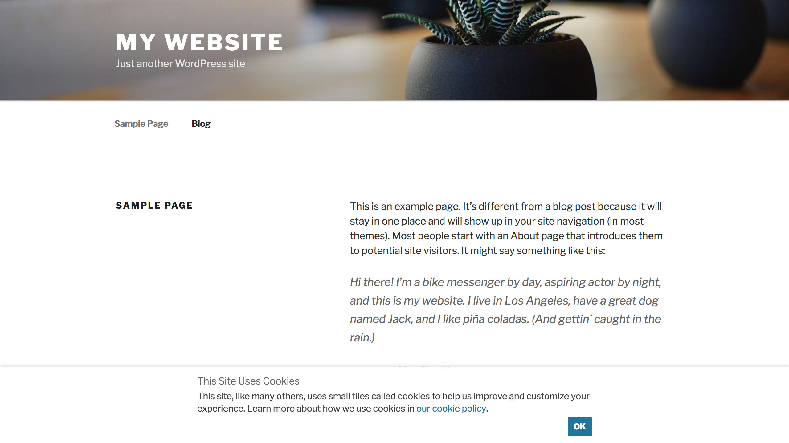

# WP GDPR Cookie Notice

Simple performant cookie consent notice that supports AMP, granular cookie control and live preview customization.

## Details

This plugin adds a simple performant cookie consent notice to your WordPress site that supports AMP, granular cookie control and live preview customization.

Not only does the notice allow you to provide the regular message that your site uses cookies, you can also optionally grant your site visitors permission to granularly allow which cookie types are allowed, supporting groups of functional (always required), preferences, analytics and marketing cookies. This aims towards compliance with how the new GDPR regulations recommend implementing cookie control for your site.

In addition to the Privacy Policy page setting that WordPress core provides, you also get a settings to optionally set an extra Cookie Policy page, and you can easily link to either of them from the cookie consent notice.

The cookie notice content and appearance can easily be tweaked using the Customizer, with an immediate live-preview of what your changes will look like.

Last but not least, another important thing that this plugin takes care of, other than most other cookie consent plugins, is that it actually ensures cookies are only placed if the respective cookie type has been allowed by the visitor. The plugin does this by implementing cookie rules for WordPress itself, and also for the following plugins:

* [AMP](https://wordpress.org/plugins/amp/)
* [Jetpack](https://wordpress.org/plugins/jetpack/)
* [Google Analytics for WordPress by MonsterInsights](https://wordpress.org/plugins/google-analytics-for-wordpress/)
* [Simple Analytics](https://wordpress.org/plugins/simple-analytics/)

More plugins will be supported in the future. If you are a developer though, it's also very easy to add cookie rules for other code, by using the flexible cookie rule component the plugin provides as an extension point.

### Feature Summary

* **Lightweight and easy-to-use:** Simply activate the plugin, and the notice will appear.
* **Live Preview:** Use the Customizer to adjust the notice to your needs, with an instant live preview.
* **Customizable Appearance:** Specify the notice position, colors, border, button size and more.
* **Customizable Content:** Adjust the notice heading, text and button label to your preferences. You can easily link to your cookie policy page or privacy policy page, and even give visitors granular control about which cookie types they allow.
* **Cookie Policy Support:** Define an optional cookie policy page if your site has one, or alternatively provide an ID attribute to the cookie section in your privacy policy.
* **Cookie Integrations:** Supported cookies are only set once the visitor has given their consent. The cookie rules implemented also respect the more granular cookie control.
* **JavaScript-driven:** The cookie notice is inserted into the page as necessary via JavaScript, but at the same time provides easy access to whether it should be displayed via its PHP API.
* **AMP Support:** The notice is fully AMP-compatible using `<amp-consent>`, integrating seamlessly with the [AMP plugin](https://wordpress.org/plugins/amp/).
* **Coding Best Practices:** The plugin is fully object-oriented and is coded after best practices, such as using interfaces, traits, dependency injection or the single responsibility principle. It also implements modern coding features requiring PHP 7, such as scalar type hints or return type hints.

### Disclaimer

This plugin does not provide any legal protection. You as a site administrator are required to ensure that it meets legal standards. This plugin is a technical tool, not a lawyer.

## Requirements

* PHP >= 7.0
* WordPress >= 4.9.6
